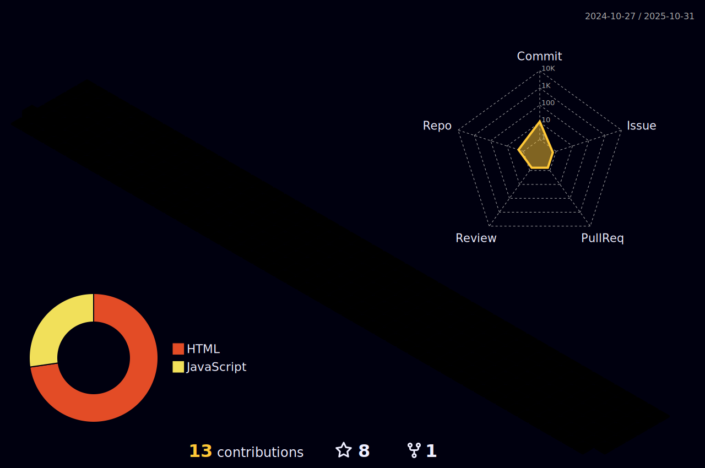

<h3 align="center">Hey there, I'm <a href="https://www.linkedin.com/in/karolina-hyla-014772193/?locale=en_US">Karolina</a> </h3>

## 📖 About me

* 💻 I'm a junior full stack web developer
* 🔥 It's never to late to learn.
---
<h3 align="center">Languages and Tools:</h3>

 
 
 

 

---

